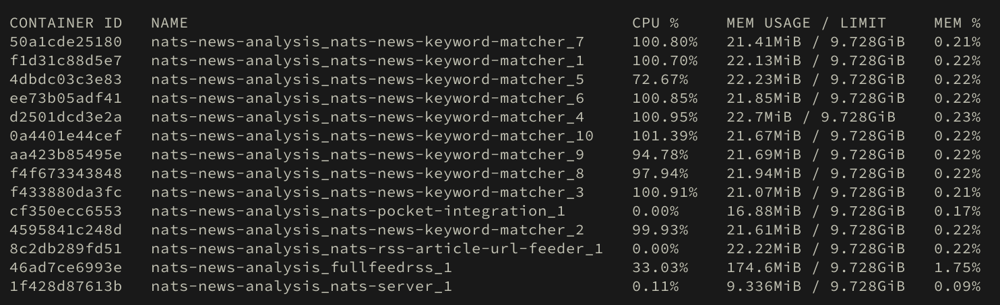

Fragt systematisch Online-Nachrichtenartikel ab, reichert sie an, sucht nach Schlagworten und sendet Treffer zu [GetPocket.com](https://getpocket.com/). Alle Komponenten sind lose mit [NATS.io](https://nats.io/) work queues gekoppelt, was es auch erlaubt, Single-Core-CPU-intensive Komponenten einfach zu skalieren.

[In Draw.io öffnen](https://app.diagrams.net/?url=https://raw.githubusercontent.com/heussd/nats-news-analysis/main/architecture.drawio)

## Beteiligte Services

Alle Services sind durch `docker-compose.yml` orchestriert und skaliert.

### Eigene Services

<!--PYSPELL-BEGIN-IGNORE-->

- [ghcr.io/heussd/nats-news-analysis/rss-article-url-feeder-python](https://ghcr.io/heussd/nats-news-analysis/rss-article-url-feeder-python) - Speist Nachrichtenartikel aus RSS-Feeds ein.
- [ghcr.io/heussd/nats-news-analysis/rss-article-url-feeder-go](https://ghcr.io/heussd/nats-news-analysis/rss-article-url-feeder-go) - Speist Nachrichtenartikel aus RSS-Feeds ein (Go re-implementation).
- [ghcr.io/heussd/nats-news-analysis/keyword-matcher-python](https://ghcr.io/heussd/nats-news-analysis/keyword-matcher-python) - Gleicht gegen eine Keyword-Liste ab.
- [ghcr.io/heussd/nats-news-analysis/keyword-matcher-go](https://ghcr.io/heussd/nats-news-analysis/keyword-matcher-go) - Gleicht gegen eine Keyword-Liste ab (Go Reimplementierung).
- [ghcr.io/heussd/nats-news-analysis/pocket-integration](https://ghcr.io/heussd/nats-news-analysis/pocket-integration) - Speist Treffer in getpocket.com ein.
- [docker.io/heussd/fivefilters-full-text-rss](https://hub.docker.com/r/heussd/fivefilters-full-text-rss) - Ruft den Volltext von Nachrichten ab.

### Drittanbieter Services

- [docker.io/nats](https://hub.docker.com/_/nats) - Event queue, Key-Value-Store und Deduplizierung.
- [NGINX](https://www.nginx.com/) - Einfacher Load Balancer / Reverse Proxy
- [Prometheus NATS Exporter](https://github.com/nats-io/prometheus-nats-exporter) - Macht NATS-Metriken für Prometheus verfügbar.
- [Prometheus](https://prometheus.io/) - Metriken und Überwachung.
- [Grafana Loki](https://grafana.com/oss/loki/) - Log-Aggregation.
- [Grafana](https://grafana.com/grafana/) - Dashboard für Metriken und Statistiken.
- [getpocket.com API](https://getpocket.com/developer/) - "Später lesen" Online-Dienst.

<!--PYSPELL-END-IGNORE-->

## Message queue zum Skalieren

Anstatt die ganze Anwendung mit einer Single-Core-CPU-intensiven Schlagwortsuche zu blockieren, oder gar eine multithreading Schlagwortsuche zu implementieren, kommt die `scale`-Option von Docker compose zum Einsatz, um eine Single-Core-CPU Schlagwortsuche parallel auszuführen, zusammengehalten von einer Message Queue. Das erlaubt es, einzelne Komponenten und deren Pflege sehr einfach zu halten.

### Schlagwortsuche, skaliert

### Ein Core pro Schlagwortsuche

## Observability

Ein typischer Prometheus-Loki-Grafana-Stack wird zur Überwachung von Anwendungsmetriken und -statistiken verwendet.

NATS-Server-Statistiken werden Prometheus über [Prometheus NATS Exporter] (https://github.com/nats-io/prometheus-nats-exporter) zur Verfügung gestellt.

Keyword-Matcher-Container verwenden Zerolog und geben ihre Logs an [Loki mit dem Docker Loki Logging Driver](https://yuriktech.com/2020/03/21/Collecting-Docker-Logs-With-Loki/) weiter.

Ein Grafana-Dashboard wird mit dem Quellcode des Repositorys ausgeliefert.

## Vergleich zwischen Python und Golang

Als eine der Kernkomponenten, die für die Hauptaufgabe der Analyse verantwortlich ist, wurde keyword-matcher aus Spaß- und Forschungsgründen von Python nach Golang portiert. Beide Implementierungen des Keyword-Matchers können nebeneinander spielen oder sogar miteinander konkurrieren:

    NAME                                                 CPU %     MEM USAGE / LIMIT
    loki                                                 1.33%     74.55MiB / 7.667GiB
    nats-news-analysis_fullfeedrss_1                     0.00%     76.68MiB / 7.667GiB
    nats-news-analysis_fullfeedrss_2                     0.01%     70.62MiB / 7.667GiB
    nats-news-analysis_grafana_1                         0.17%     35.95MiB / 7.667GiB
    nats-news-analysis_keyword-matcher-go_1              0.00%     8.051MiB / 7.667GiB
    nats-news-analysis_keyword-matcher-go_2              0.00%     8.422MiB / 7.667GiB
    nats-news-analysis_keyword-matcher-go_3              0.00%     8.781MiB / 7.667GiB
    nats-news-analysis_keyword-matcher-go_4              0.00%     8.059MiB / 7.667GiB
    nats-news-analysis_keyword-matcher-python_1          0.00%     22.64MiB / 7.667GiB
    nats-news-analysis_keyword-matcher-python_2          0.00%     23.21MiB / 7.667GiB
    nats-news-analysis_keyword-matcher-python_3          0.00%     24.23MiB / 7.667GiB
    nats-news-analysis_keyword-matcher-python_4          0.00%     23.8MiB / 7.667GiB
    nats-news-analysis_loadbalancer_1                    0.00%     2.316MiB / 7.667GiB
    nats-news-analysis_nats-server_1                     1.34%     92.97MiB / 7.667GiB
    nats-news-analysis_natsexporter_1                    0.03%     7.41MiB / 7.667GiB
    nats-news-analysis_pocket-integration_1              0.00%     18.41MiB / 7.667GiB
    nats-news-analysis_prometheus_1                      0.00%     37.22MiB / 7.667GiB
    nats-news-analysis_rss-article-url-feeder-go-1st_1   0.05%     15.32MiB / 7.667GiB
    nats-news-analysis_rss-article-url-feeder-go-2nd_1   11.46%    12.95MiB / 7.667GiB

Hier sind einige interessante Statistiken von Docker und Loki, die während des regulären Betriebs gesammelt wurden:

| Metrik             | Python  | Golang  | Vergleich                              |
| ------------------ | ------- | ------- | -------------------------------------- |
| Docker-Image-Größe | 424MB   | 6.09MB  | Go impl. ist ~70x kleiner              |
| Speicherverbrauch  | 23,8MiB | 8,33MiB | Go impl. benötigt ~3x weniger Speicher |
| LoC                | 447     | 485     | Python impl. hat ~8% weniger Zeilen    |
