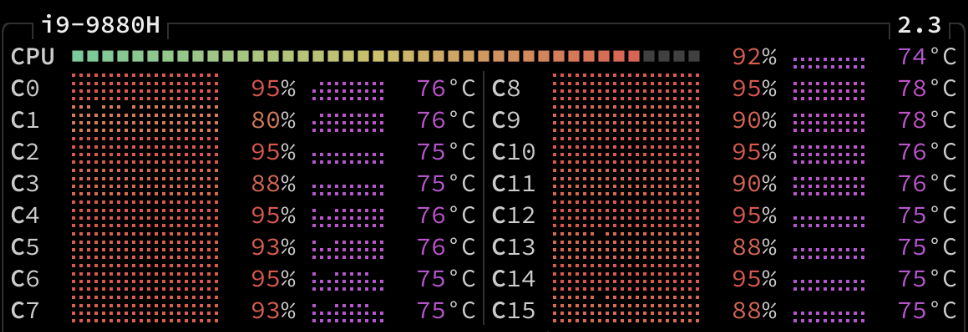

Fragt systematisch Online-Nachrichtenartikel ab, reichert sie an, sucht nach Schlagworten und sendet Treffer zu [GetPocket.com](https://getpocket.com/). Alle Komponenten sind lose mit [NATS.io](https://nats.io/) work queues gekoppelt, was es auch erlaubt, Single-Core-CPU-intensive Komponenten einfach zu skalieren.

## Message queue zum Skalieren

Anstatt die ganze Anwendung mit einer Single-Core-CPU-intensiven Schlagwortsuche zu blockieren, oder gar eine multithreading Schlagwortsuche zu implementieren, kommt die `scale`-Option von Docker compose zum Einsatz, um eine Single-Core-CPU Schlagwortsuche parallel auszuführen, zusammengehalten von einer Message Queue. Das erlaubt es, einzelne Komponenten und deren Pflege sehr einfach zu halten.

### Schlagwortsuche, skaliert

### Ein Core pro Schlagwortsuche

