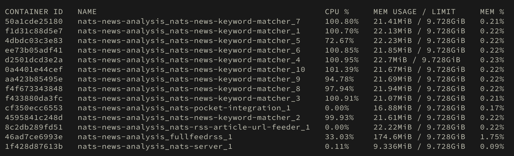
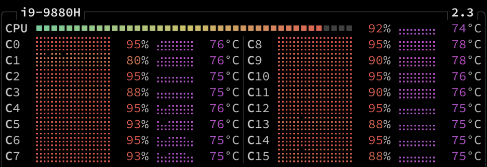
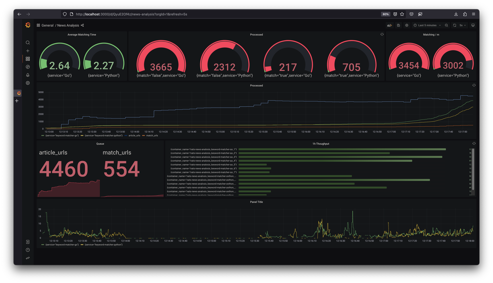

Systematically retrieves online news articles, enriches them, scans them for keywords and sends hits to [raindrop.io](https://raindrop.io/). All analysis components are loosely-coupled with [NATS.io](https://nats.io/) work queues, which also allows scaling single-core-CPU-intensive components easily.

[Open In Draw.io](https://app.diagrams.net/?url=https://raw.githubusercontent.com/heussd/nats-news-analysis/main/architecture.drawio)

The system has three NATS queues:

1. `feed-urls` - URLs of RSS feeds.
2. `article-urls` - URLs of individual articles of RSS feeds.
3. `match-urls` - URLs of positive matching articles.

## Involved services

All services are orchestrated and scaled with `compose.yml`.

### Custom services

-   [ghcr.io/heussd/nats-news-analysis/rss-feed-feeder](https://ghcr.io/heussd/nats-news-analysis/rss-feed-feeder) - **Bash** - Feeds rss feed urls from a text file.
-   [ghcr.io/heussd/nats-news-analysis/rss-article-url-feeder-go](https://ghcr.io/heussd/nats-news-analysis/rss-article-url-feeder-go) - **Golang** - Feeds news articles from RSS feeds.
-   [ghcr.io/heussd/nats-news-analysis/keyword-matcher-go](https://ghcr.io/heussd/nats-news-analysis/keyword-matcher-go) - **Golang** - Matches against keywords list.
-   [ghcr.io/heussd/nats-news-analysis/raindrop-integration](https://ghcr.io/heussd/nats-news-analysis/raindrop-integration) - **Golang** - Publishes matches on [raindrop.io](https://raindrop.io/).

### Third party services

-   [docker.io/heussd/fivefilters-full-text-rss](https://hub.docker.com/r/heussd/fivefilters-full-text-rss) - Retrieves full text of web pages.
-   [docker.io/nats](https://hub.docker.com/_/nats) - Event queue, key-value store and deduplication.
-   [NGINX](https://www.nginx.com/) - Simple load balancer / reverse proxy
-   [Prometheus NATS Exporter](https://github.com/nats-io/prometheus-nats-exporter) - Make NATS metrics available to Prometheus
-   [Prometheus](https://prometheus.io/) - Metrics & monitoring
-   [Grafana Loki](https://grafana.com/oss/loki/) - Log aggregation
-   [Grafana](https://grafana.com/grafana/) - Dashboard for metrics and stats

## Message queue for scaling

Instead of blocking the application with a single core keyword matching operation, or even trying to build a complex multi-threading keyword matching, we are using the `scale` option of docker compose to run multiple single-core keyword matching components in parallel, wired together with the message queue. This allows us to keep individual components super straight-forward and easy to maintain.

### Keyword matching containers, scaled up

### One core per keyword matching

## Observability

A typical Prometheus-Loki-Grafana stack is used to monitor application metrics and statistics.

NATS server stats are made available to Prometheus via [Prometheus NATS Exporter](https://github.com/nats-io/prometheus-nats-exporter).

Keyword-matcher-containers use zerolog and expose their logs to [Loki using the Docker Loki logging driver](https://yuriktech.com/2020/03/21/Collecting-Docker-Logs-With-Loki/).

A Grafana dashboard ships with the source of the repository.

## Comparing Python with Golang

As one of the core components responsible for the main analysis task, keyword-matcher has been ported from Python to Golang, for fun and research purposes. Both implementations of keyword-matcher can play alongside or even to compete with each other:

    NAME                                                 CPU %     MEM USAGE / LIMIT
    loki                                                 1.33%     74.55MiB / 7.667GiB
    nats-news-analysis_fullfeedrss_1                     0.00%     76.68MiB / 7.667GiB
    nats-news-analysis_fullfeedrss_2                     0.01%     70.62MiB / 7.667GiB
    nats-news-analysis_grafana_1                         0.17%     35.95MiB / 7.667GiB
    nats-news-analysis_keyword-matcher-go_1              0.00%     8.051MiB / 7.667GiB
    nats-news-analysis_keyword-matcher-go_2              0.00%     8.422MiB / 7.667GiB
    nats-news-analysis_keyword-matcher-go_3              0.00%     8.781MiB / 7.667GiB
    nats-news-analysis_keyword-matcher-go_4              0.00%     8.059MiB / 7.667GiB
    nats-news-analysis_keyword-matcher-python_1          0.00%     22.64MiB / 7.667GiB
    nats-news-analysis_keyword-matcher-python_2          0.00%     23.21MiB / 7.667GiB
    nats-news-analysis_keyword-matcher-python_3          0.00%     24.23MiB / 7.667GiB
    nats-news-analysis_keyword-matcher-python_4          0.00%     23.8MiB / 7.667GiB
    nats-news-analysis_loadbalancer_1                    0.00%     2.316MiB / 7.667GiB
    nats-news-analysis_nats-server_1                     1.34%     92.97MiB / 7.667GiB
    nats-news-analysis_natsexporter_1                    0.03%     7.41MiB / 7.667GiB
    nats-news-analysis_pocket-integration_1              0.00%     18.41MiB / 7.667GiB
    nats-news-analysis_prometheus_1                      0.00%     37.22MiB / 7.667GiB
    nats-news-analysis_rss-article-url-feeder-go-1st_1   0.05%     15.32MiB / 7.667GiB
    nats-news-analysis_rss-article-url-feeder-go-2nd_1   11.46%    12.95MiB / 7.667GiB

Here are some interesting stats from Docker and Loki, collected during regular operation:

| Metric             | Python  | Golang  | Comparison                      |
| ------------------ | ------- | ------- | ------------------------------- |
| Docker image size  | 424MB   | 6.09MB  | Go impl. is ~70x smaller        |
| Memory consumption | 23,8MiB | 8,33MiB | Go impl. needs ~3x less memory  |
| LoC                | 447     | 485     | Python impl. has ~8% less lines |
